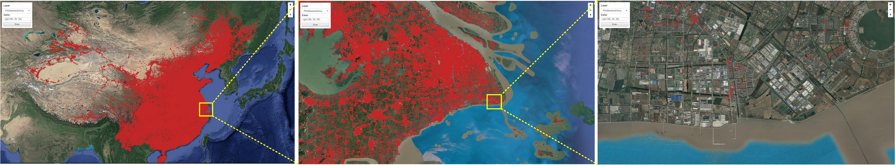
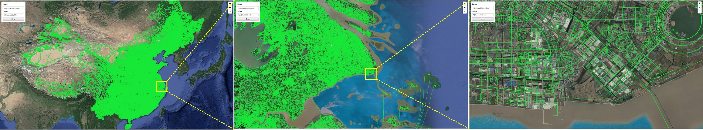
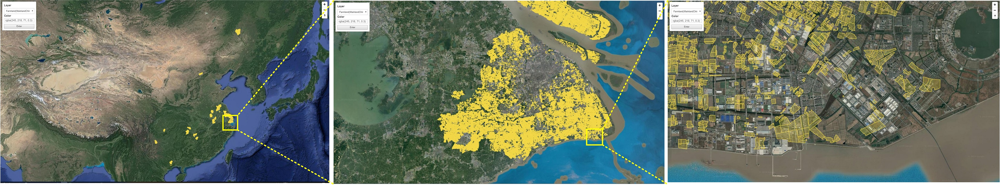

# HiVision


## [Online Demo1](http://www.higis.org.cn:8080/hivision/) 

## [Online Demo2](http://www.higis.org.cn:8080/hivision_with_pattern/)


## Setting: 

***Tab1. Datasets: Roads, POI and Farmland of Mainland China (10-million-scale)***

| Name           | Type       | Records    | Size                 |
| -------------- | ---------- | ---------- | -------------------- |
| China_Road     | LineString | 21,898,508 | 163,171,928 segments |
| China_POI      | Point      | 20,258,450 | 20,258,450 points    |
| China_Farmland | Polygon    | 10,520,644 | 133,830,561 edges    |

***Tab2.  Demo Environment***

| Item             | Description                                    |
| ---------------- | ---------------------------------------------- |
| CPU              | 4core, Intel(R) Xeon(R) CPU E5-2680 v3@2.50GHz |
| Memory           | 32 GB                                          |
| Operating System | Centos7                                        |

#### Application Scenarios:

The datasets (see Tab 1) used in the demonstration are provided by map service providers. As the datasets are not open published, the raw datasets are encrypted by adding offsets. The interface of the demonstration is simple to use, choose a dataset and click the Enter button, then the visualizing results will be added to the map in real time. Fig 1-3 show the visualizing results.



*Fig1. China_POI*



*Fig2. China_Road*



*Fig3. China_Farmland*


## Open Source

#### Software dependencies:

[Redis](https://redis.io) (recommended version 3.2.12)

[hiredis](https://github.com/redis/hiredis) (recommended version 0.13.3)

[MPICH](http://www.mpich.org/) (recommended version 3.0.4)

[Boost C++ Libraries](https://www.boost.org/) (recommended version 1.64)

[Geospatial Data Abstraction Library (GDAL)](http://www.gdal.org/) >=2.0 (recommended version 2.1.2)

[libpng](http://www.libpng.org/pub/png//libpng.html) (recommended version 1.2.59)

#### Compile:

Run the following command to generate the executable programs:

> ```shell
> $ mkdir build # Create a build directory
> $ cd build # Move into build directory
> $ cmake .. # Configure for your system
> $ make # Generate the executable programs
> $ cd .. # Move back to source directory
> ```

#### Run& Stop:

Edit the following parameters in "start.sh":

**indexpath**: path to store the spatial indexes (default : "./indexes/")

**shppath**: path of the input shapefiles (default : "./datasets/alaska_OSM/")

**patternpath**: path of the input patterns(default : "./patterns/")

**process**: MPI process count (default:4)

**redishost**: host IP of Redis (default:"127.0.0.1")

**redisport**: host Port of Redis (default:6379)

**serviceport**: port of the service (default:10080)

Then run the following scripts to start/stop HiVision automatically:

> ```shell
> $ sh ./start.sh
> ```

> ```shell
> $ sh ./stop.sh
> ```

#### Registration& Visualization Service:

Registration (Point: type=0/ LineString: type=1/ Polygon: type=2):

> ```react
> http://localhost:10080/HiVision/add/{shapefile_name}/{id}/{type}
> ```

Visualization WMTS:

> ```react
> http://localhost:10080/HiVision/{index_id}/{R}/{G}/{B}/{A}/{z}/{x}/{y}.png
> ```

Example:

> ```react
> (Point) datasets/alaska_OSM/gis_osm_places_free_1.shp 
> http://localhost:10080/HiVision/add/gis_osm_places_free_1/places/0
> http://localhost:10080/HiVision/pplaces/{R}/{G}/{B}/{A}/{z}/{x}/{y}.png
> (LineString) datasets/alaska_OSM/gis_osm_roads_free_1.shp
> http://localhost:10080/HiVision/add/gis_osm_roads_free_1/roads/1
> http://localhost:10080/HiVision/lroads/{R}/{G}/{B}/{A}/{z}/{x}/{y}.png
> (Polygon) datasets/alaska_OSM/gis_osm_buildings_a_free_1.shp 
> http://localhost:10080/HiVision/add/gis_osm_buildings_a_free_1/buildings/2
> http://localhost:10080/HiVision/abuildings/{R}/{G}/{B}/{A}/{z}/{x}/{y}.png
> ```


## Contact

Mengyu Ma@ National University of Defense Technology

Email: mamengyu10@nudt.edu.cn

Tel:+8615507487344
